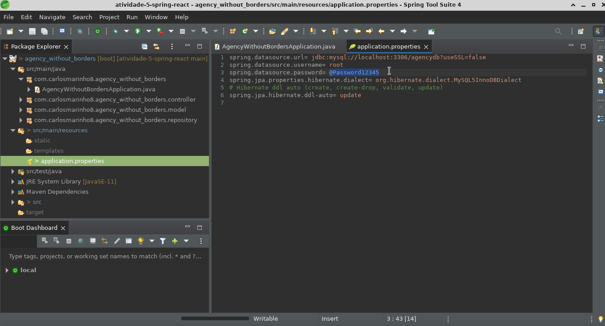
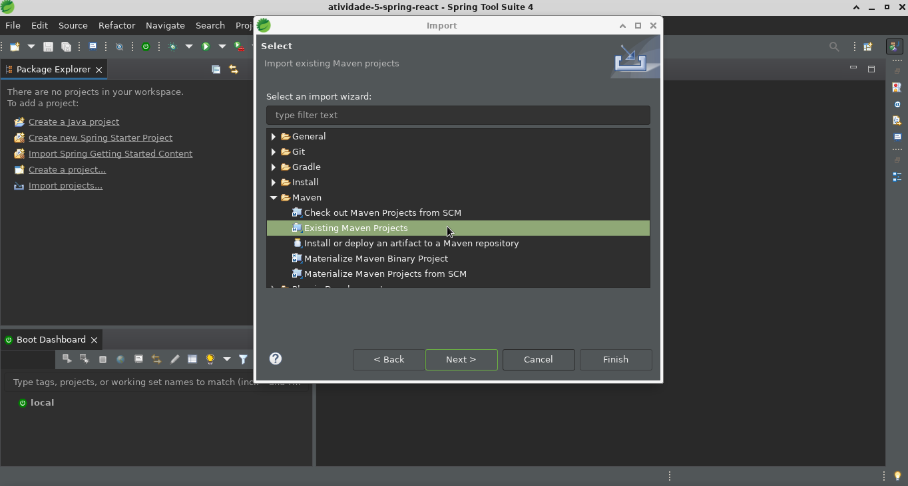
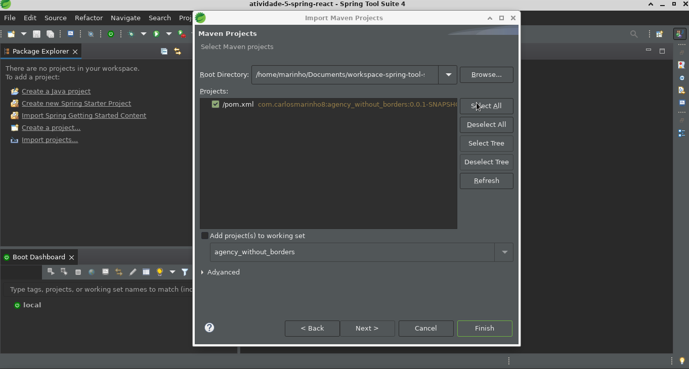
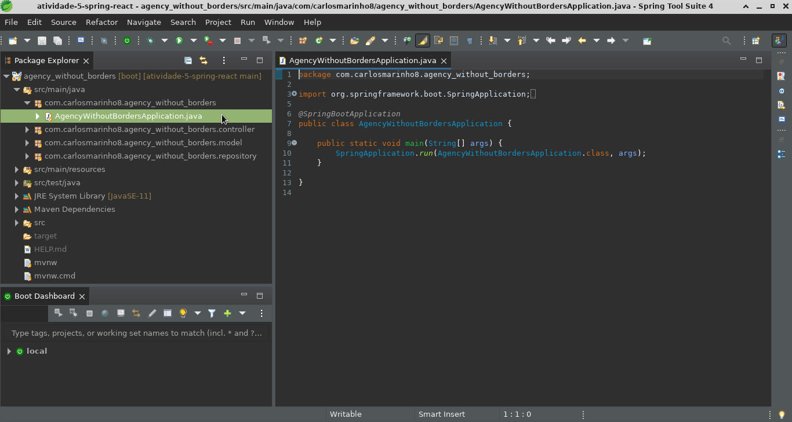
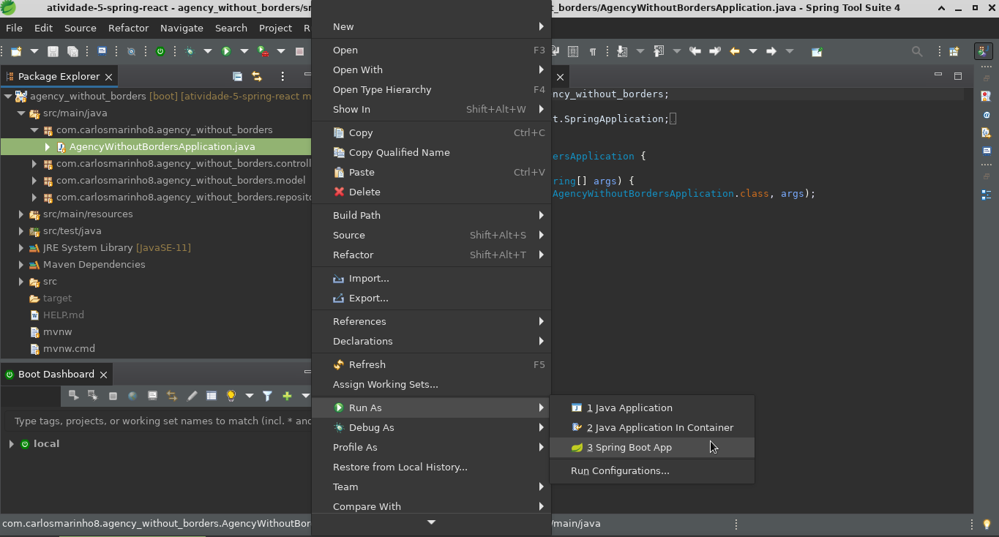
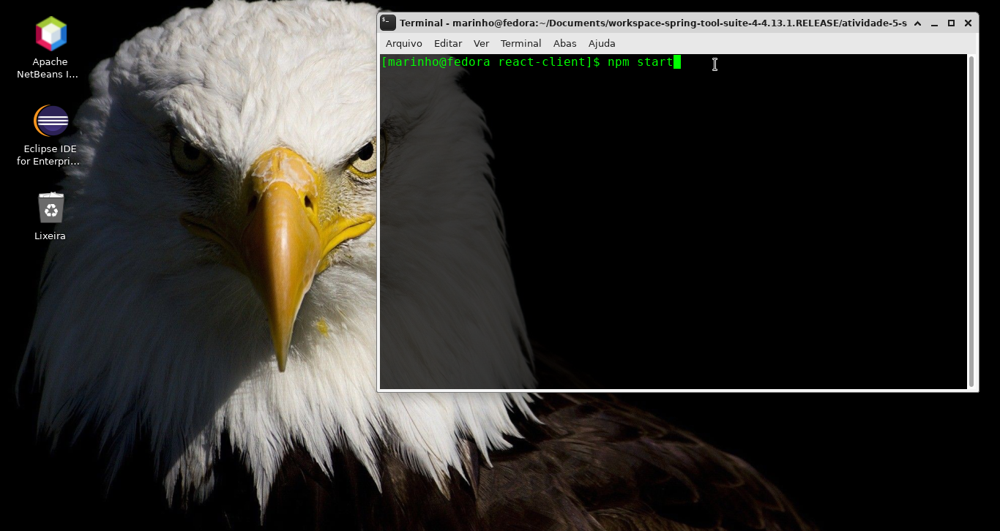

# atividade-5-spring-react
## Requirements
- Java11+
- Spring tool suite, Eclipse or Itellij idea
- Mysql
- Nodejs and Npm
- Browser

## Comments

change password according to your database

 

 

and now create a database called "clients"

<code>CREATE DATABASE clients;</code>
 
 
 
 

import an existing maven

 
 
 
 

select all

 

 
 
 
 

open

<ol>
    <li>agency_without_borders<li>
    &nbsp;&nbsp;<li>src/main/java</li>
    &nbsp;&nbsp;&nbsp;&nbsp;<li>com.carlosmarinho8.agency_whithout_borders</li>
    &nbsp;&nbsp;&nbsp;&nbsp;&nbsp;&nbsp;<li>AgencyWithoutBordersApplication.java</li>  
<ol>
 

 
 
 
 

run the file as spring or in the terminal run the command <code>mvn spring-boot:run</code

 

 
 
 
 

now run react which is in react-client, write in terminal npm install react and then npm start.
the terminal will open the project on port 8081

 
 
 
 
## Annotations

– @Entity annotation indicates that the class is a persistent Java class.
– @Table annotation provides the table that maps this entity.
– @Id annotation is for the primary key.
– @GeneratedValue annotation is used to define generation strategy for the primary key. GenerationType.AUTO means Auto Increment field.
– @Column annotation is used to define the column in database that maps annotated field.
 
 
– findByPublished(): returns all Clients with published having value as input published.
– findByNameContaining(): returns all Clients which title contains input title.
 
 
– @CrossOrigin is for configuring allowed origins.
– @RestController annotation is used to define a controller and to indicate that the return value of the methods should be be bound to the web response body.
– @RequestMapping("/api") declares that all Apis’ url in the controller will start with /api.
– We use @Autowired to inject ClientRepository bean to local variable.
 
 
– ClientsList component gets and displays Clients.
– Client component has form for editing Client’s details based on :id.
– AddClient component has form for submission new Client.
These Components call ClientDataService methods which use axios to make HTTP requests and receive responses.

